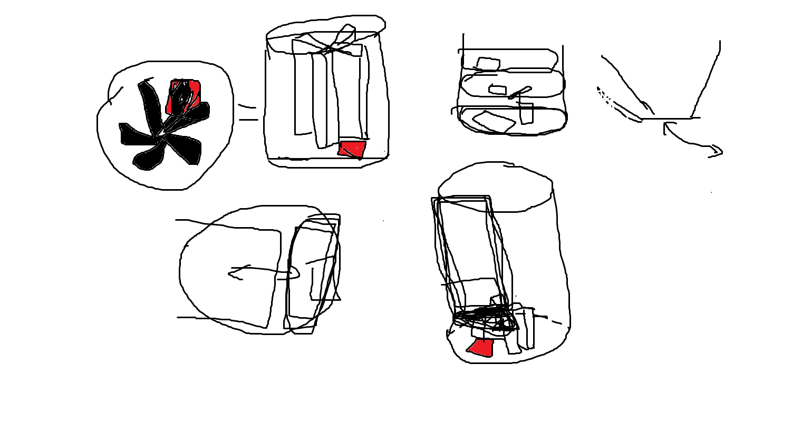
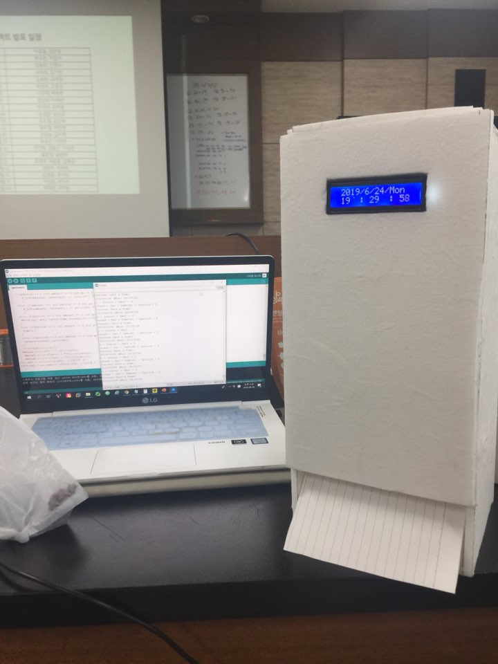

## Arduino Dog feeder
Arduino Dog feeder for 2019 PNU CSE 1st Semester Project

부산대 전기컴퓨터공학부 정보컴퓨터공학전공 컴퓨터기초실험 프로젝트

학과 | 학번 | 성명 | 학과 | 학번 | 성명
---- | ---- | ---- | ---- | ---- | ---- 
정보컴퓨터공학전공 |201524495 |안준수 | 정보컴퓨터공학전공 |201661701 |강동민

## 프로젝트 개요
<strong>프로젝트 디자인</strong>
<!--  -->

<strong>프로젝트 계획</strong>

<strong>[부산대 전기컴퓨터공학부 정보컴퓨터공학전공](https://cse.pusan.ac.kr)</strong> 컴퓨터기초실험 과목 기말과제

차후에 웹, ANDROID 및 iOS 어플리케이션, GUI 관련 툴 등을 학습하여 연계할 수 있을 것으로 생각하여 선택하였고,
실제로 공부해둔 간단한 폼보드 제작과 연계함.

<strong>프로젝트 최종 목표</strong>

<em>아두이노를 통해 개밥주는 dog feeder를 설계함.</em>

<strong>프로젝트 진행 과정</strong>

외부 프레임은 폼보드 사용

소리감지센서로 개 짖는 소리 감지

녹음모듈을 통해 반려견 주인 목소리 녹음하여 개가 짖을 때 재생

모터를 이용해 사료급여

RTC모듈을 이용하여 시각 표시

8옴 스피커를 통해 개가 싫어하는 주파수 재생
